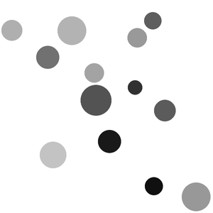

# 2d-Collision-Simulation

 Simulação de colisão elástica bidimensional entre bolas.

 

 Ao rodar "app.py" são geradas bolas com massa, raio, posição e velocidade inicial aleatórias e inicia-se a simulação.
 Quanto mais escura a bola mais massiva ela é.
